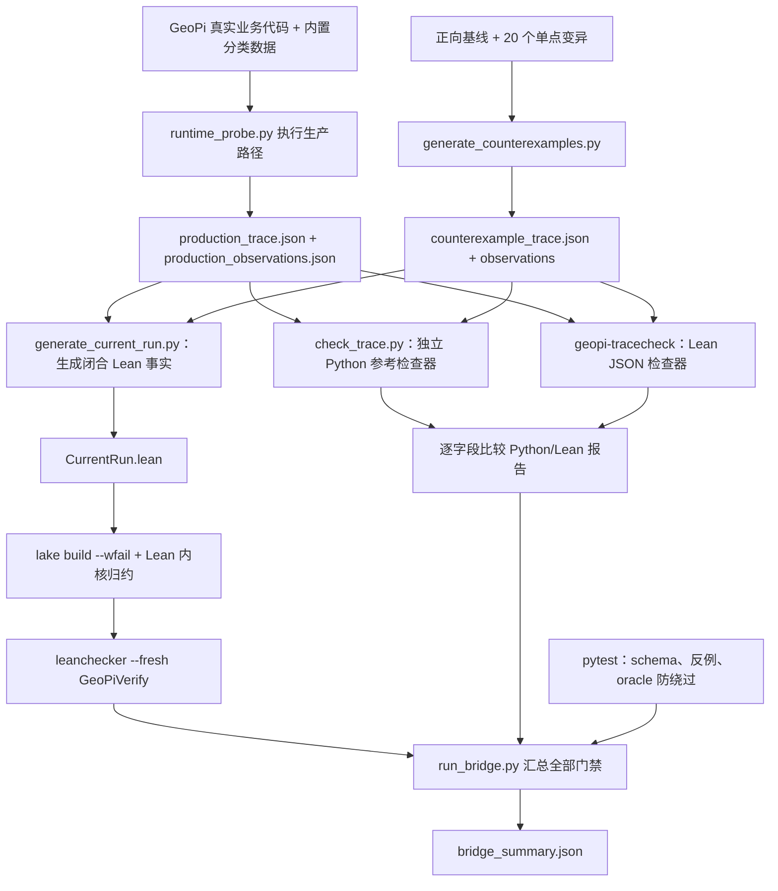

# Geochemistry π Lean 形式化验证：复现、运行与扩展指南

本文面向需要在本地复现、维护或扩展 Geochemistry π（GeoPi）Lean 验证流程的开发者。文档覆盖 macOS 与 Windows 的独立环境搭建、完整桥接流程、输出判读、现有命题与七项业务修复的关系，以及新增命题或审计路径时必须同步修改的位置。

> 快速入口：在仓库根目录激活 Python 3.12 虚拟环境并安装 `formal_verification/requirements.txt`，确认 Elan 可用后，运行 `python formal_verification/python/run_bridge.py`。最终以 `formal_verification/results/bridge_summary.json` 中的 `bridgePassed: true` 为成功标准。

## 1. 验证目标、当前结论与边界

这套流程连接了三层内容：

1. GeoPi 的真实 Python 业务路径与内置分类数据；
2. Python 运行时探针生成的 schema-v2 审计事实；
3. Lean 中的闭合事实、可判定命题、反例和内核检查。

第一轮生产审计中有七项命题未通过：`D04`、`D05`、`P02`、`P03`、`L03`、`A02`、`E02`。在业务代码中完成最小侵入修改后，第二轮审计结果为：

- 20/20 个公开命题通过；
- 20 个单点反例全部被拒绝，且每个反例只触发目标命题；
- Python 参考检查器与 Lean 检查器的 JSON 报告完全一致；
- `lake build --wfail`、`leanchecker --fresh GeoPiVerify` 和 15 个 Python 测试全部通过。

这里的“形式化验证”需要按正确边界理解：Lean 内核证明的是“写入闭合 `CaseTrace` 的事实满足指定命题”。Python 解释器、第三方机器学习库、`runtime_probe.py` 的观测实现，以及 JSON 到 Lean 常量的生成器仍属于可信计算基（trusted computing base）。双检查器逐字段一致、单点反例覆盖、真实业务探针和 `leanchecker` 能显著压缩这一边界，但不等同于对整个 Python 解释器或 scikit-learn 实现做端到端形式化语义证明。

## 2. 支持的平台与锁定版本

| 组件 | 项目要求 | 说明 |
| --- | --- | --- |
| macOS | Apple Silicon 或 Intel | 当前基线实测为 Apple Silicon；命令同时适用于 Intel macOS |
| Windows | Windows 10/11 x64 | 使用原生 PowerShell；Windows ARM 尚未作为本项目基线实测 |
| Python | 64 位 CPython 3.12 | 当前结果由 Python 3.12.13 生成；不要直接复用 GeoPi 主项目的旧依赖环境 |
| Lean | `leanprover/lean4:v4.32.2` | 由 `formal_verification/lean-toolchain` 锁定；Elan 自动选择和下载 |
| Lake | 随上述 Lean 工具链提供 | 项目声明位于 `formal_verification/lakefile.toml` |
| Git | 可用的近期版本 | Elan/Lake 和来源提交记录均依赖 Git |

验证依赖被单独锁定在 `formal_verification/requirements.txt`。它有意不修改 GeoPi 根目录的 Python 业务依赖锁，因此必须使用独立虚拟环境。不要把系统 Python、GeoPi 的生产环境和形式化验证环境混在一起。

官方安装入口：

- [Lean 手动安装说明](https://lean-lang.org/install/manual/)
- [Elan 官方仓库与跨平台安装命令](https://github.com/leanprover/elan)
- [Python 3.12 `venv` 文档](https://docs.python.org/3.12/library/venv.html)

## 3. 目录与职责

```text
formal_verification/
├── lean-toolchain                  # Lean 版本的唯一来源
├── lakefile.toml                   # Lean 库和 geopi-tracecheck 可执行文件
├── lake-manifest.json              # Lake 锁文件
├── requirements.txt                # 隔离的 Python 审计依赖
├── trace_schema_v2.md              # Python/JSON/Lean 之间的事实契约
├── GeoPiVerify.lean                # Lean 库总入口
├── GeoPiVerify/
│   ├── Types.lean                  # schema-v2 对应的 Lean 数据结构
│   ├── Predicates.lean             # 20 个公开业务命题
│   ├── Checker.lean                # 命题注册表、报告与证书入口
│   ├── Theorems.lean               # 接受结论及关键蕴含定理
│   ├── Fixtures.lean               # 手写正向夹具与关键反例
│   ├── Main.lean                   # JSON 命令行检查器
│   └── Generated/CurrentRun.lean   # 由 JSON 自动生成的闭合事实和定理
├── python/
│   ├── runtime_probe.py            # 执行真实 GeoPi 路径并生成生产事实
│   ├── generate_counterexamples.py # 生成 1 个基线 + 20 个单点反例
│   ├── check_trace.py              # 严格 schema 解码和独立 Python 检查器
│   ├── generate_current_run.py     # 把 JSON 事实翻译为 Lean 常量/定理
│   └── run_bridge.py               # 完整闭环的唯一推荐入口
├── tests/test_python_checker.py    # schema、反例、无 oracle 绕过等回归测试
└── results/                        # 轨迹、报告、观测和命令日志
```

以下目录不是本验证分支的运行依赖，不应作为流程代码提交：

- `Lean_verification_docs/`：论文材料和阶段性说明，仅作为本地研究参考；
- `.codegraph/`：本地 CodeGraph 工具状态；
- `tmp/` 以及其他本地工作目录：脚本、渲染或临时环境；
- `formal_verification/.lake/`、`__pycache__/`、`*.pyc`：可重建产物。

## 4. 首次获取代码

如果尚未克隆仓库：

```text
git clone https://github.com/quzhenghao/Geochemistrypi.git
cd Geochemistrypi
```

若本功能分支尚未合并到主线，再执行：

```text
git fetch origin
git switch qzh
```

后续所有命令默认从仓库根目录执行。路径中可以包含空格，但建议 Windows 用户把仓库放在较短路径下，避免旧版工具的路径长度限制。

## 5. macOS 环境搭建

### 5.1 准备 Git、编译工具和 Python

先确认命令行开发工具与 Git：

```bash
xcode-select -p
git --version
```

如果 `xcode-select -p` 报错，可执行 `xcode-select --install` 并完成系统安装。随后安装 64 位 CPython 3.12（可使用 Python 官网安装包或团队认可的包管理器），确认：

```bash
python3.12 --version
```

### 5.2 安装 Elan

```bash
curl https://elan.lean-lang.org/elan-init.sh -sSf | sh
source "$HOME/.elan/env"
elan --version
```

安装程序会把 Elan 放在 `~/.elan`。若新终端仍找不到 `elan`，先执行 `source "$HOME/.elan/env"`，再检查 shell 配置是否包含 Elan 的 PATH 设置。

### 5.3 创建隔离环境并安装依赖

```bash
python3.12 -m venv .venv-lean
source .venv-lean/bin/activate
python --version
python -m pip install --upgrade pip
python -m pip install -r formal_verification/requirements.txt
```

### 5.4 触发锁定工具链下载

```bash
cd formal_verification
lean --version
lake --version
elan show
cd ..
```

在 `formal_verification/` 下调用 `lean` 或 `lake` 时，Elan 会读取 `lean-toolchain` 并自动安装/选择 Lean 4.32.2。第一次下载需要网络，耗时明显长于后续运行。

## 6. Windows 环境搭建

以下命令使用 64 位 Windows 10/11 和 PowerShell 7.4 或更新版本。建议安装当前 PowerShell、Git for Windows 以及 64 位 CPython 3.12，并在 Python 安装器中启用 launcher。先确认：

```powershell
git --version
py -3.12 --version
```

### 6.1 安装 Elan

按照 Elan 官方 PowerShell 入口执行：

```powershell
curl.exe -O -L https://elan.lean-lang.org/elan-init.ps1
pwsh -ExecutionPolicy Bypass -File .\elan-init.ps1
Remove-Item .\elan-init.ps1
$env:Path = "$HOME\.elan\bin;$env:Path"
elan --version
```

安装完成后最好关闭并重新打开 PowerShell。如果仍提示找不到 `elan`、`lean` 或 `lake`，确认 `%USERPROFILE%\.elan\bin` 已在用户 PATH 中；当前会话可以继续使用上面的 `$env:Path` 设置。

### 6.2 创建隔离环境并安装依赖

```powershell
py -3.12 -m venv .venv-lean
Set-ExecutionPolicy -Scope Process -ExecutionPolicy Bypass
.\.venv-lean\Scripts\Activate.ps1
python --version
python -m pip install --upgrade pip
python -m pip install -r .\formal_verification\requirements.txt
```

`Set-ExecutionPolicy -Scope Process` 只影响当前 PowerShell 进程，用于允许虚拟环境激活脚本；不需要修改整台机器的永久策略。

### 6.3 触发锁定工具链下载

```powershell
Push-Location .\formal_verification
lean --version
lake --version
elan show
Pop-Location
```

## 7. 一条命令运行完整闭环

macOS 与 Windows 在虚拟环境激活后使用同一入口；在仓库根目录运行：

```text
python formal_verification/python/run_bridge.py
```

桥接脚本会读取 `formal_verification/lean-toolchain`。`--toolchain` 只用于一次性的诊断覆盖，例如测试升级候选版本；常规复现不要传该参数。

默认每个子命令最多运行 600 秒。低性能机器或首次构建可临时提高超时：

macOS：

```bash
export GEOPI_BRIDGE_TIMEOUT_SECONDS=1200
python formal_verification/python/run_bridge.py
```

Windows PowerShell：

```powershell
$env:GEOPI_BRIDGE_TIMEOUT_SECONDS = "1200"
python .\formal_verification\python\run_bridge.py
```

成功时进程退出码为 `0`，终端输出和 `formal_verification/results/bridge_summary.json` 至少应满足：

```json
{
  "bridgePassed": true,
  "productionConforms": true,
  "counterexampleSuitePassed": true,
  "counterexampleReportsExactlyEqual": true,
  "productionReportsExactlyEqual": true,
  "checkerExitCodesMatch": true,
  "publicCheckCount": 20,
  "productionPassedCheckCount": 20,
  "productionFailedCheckCount": 0,
  "counterexampleCount": 20,
  "coveredCheckCount": 20,
  "counterexampleCoverageComplete": true,
  "allCounterexamplesIsolated": true
}
```

不要只看 `lake build` 成功，也不要只看生产案例通过；上述桥接条件必须整体成立。

## 8. 完整运行流程



`run_bridge.py` 按以下顺序执行，顺序本身是安全门禁的一部分：

1. 读取锁定工具链并记录 `lean --version`；
2. 生成正向基线和 20 个单点反例；
3. 只基于反例轨迹生成一次 `CurrentRun.lean` 并构建，先证明反例体系本身可用；
4. 分别用 Python 和 Lean 检查反例轨迹；
5. 确认两份报告完全相等、20 个公开命题都有反例、每个反例只失败一个目标命题；
6. 执行真实 GeoPi 分类业务路径，输出生产轨迹和来源观测；
7. 合并反例与生产事实，重新生成 `CurrentRun.lean` 并执行最终构建；
8. 分别用 Python 和 Lean 检查生产轨迹，并逐字段比较报告；
9. 用 `leanchecker --fresh GeoPiVerify` 重新检查构建产物；
10. 运行 Python 回归测试；
11. 汇总所有退出码和语义条件，写入 `bridge_summary.json`。

反例检查器返回 `1` 是预期行为：轨迹中故意包含 20 个应被拒绝的案例。桥接脚本要求 Python 与 Lean 都对反例返回 `1`，再检查“拒绝原因是否正确且隔离”。退出码语义如下：

| 退出码 | Python/Lean 轨迹检查器 | 完整桥接脚本 |
| --- | --- | --- |
| `0` | 输入合法且所有案例满足 `Conforms` | 所有构建、比较、生产审计和测试通过 |
| `1` | 输入合法，但至少一个案例不满足 `Conforms` | 至少一个桥接门禁未通过 |
| `2` | schema、文件、运行环境或解析错误 | 子命令异常；查看对应 stderr 日志 |

## 9. 手动分步复核

日常开发优先使用完整桥接。定位问题时可以分步执行。

### 9.1 生成反例轨迹

```text
python formal_verification/python/generate_counterexamples.py \
  --trace formal_verification/results/counterexample_trace.json \
  --observations formal_verification/results/counterexample_observations.json
```

Windows PowerShell 可把反斜杠续行改为反引号，或直接写成一行。

### 9.2 执行真实生产探针

```text
python formal_verification/python/runtime_probe.py \
  --trace formal_verification/results/production_trace.json \
  --observations formal_verification/results/production_observations.json
```

生产探针实际读取：

- `geochemistrypi/data_mining/data/dataset/Data_Classification.xlsx`；
- `geochemistrypi/data_mining/data/dataset/ApplicationData_Classification.xlsx`。

它会执行特征构造、切分、训练集拟合、推理状态复用、标签编码与持久化、模型预测和产物导出等真实业务函数。探针不得仅通过读取源代码字符串“宣称”运行事实；能动态观测的事实应来自实际调用或输出。

### 9.3 生成闭合 Lean 事实

```text
python formal_verification/python/generate_current_run.py \
  --counterexamples formal_verification/results/counterexample_trace.json \
  --production formal_verification/results/production_trace.json \
  --output formal_verification/GeoPiVerify/Generated/CurrentRun.lean
```

`CurrentRun.lean` 是生成文件，不要手工编辑。需要改变内容时，应修改轨迹 schema、探针或生成器，然后重新生成。

### 9.4 构建并检查 Lean

macOS：

```bash
cd formal_verification
lake build --wfail
lake env leanchecker --fresh GeoPiVerify
cd ..
```

Windows PowerShell：

```powershell
Push-Location .\formal_verification
lake build --wfail
lake env leanchecker --fresh GeoPiVerify
Pop-Location
```

`--wfail` 把 Lean 警告升级为构建失败。生成定理使用 `by decide +kernel`，并通过 `#print axioms` 暴露公理依赖；维护者不得用 `sorry`、`admit` 或任意未说明公理绕过命题。

### 9.5 比较两个检查器

Python：

```text
python formal_verification/python/check_trace.py \
  formal_verification/results/production_trace.json \
  --output formal_verification/results/production_python_report.json
```

Lean：

```bash
cd formal_verification
lake exe geopi-tracecheck results/production_trace.json > results/production_lean_report.json
cd ..
```

不要只比较通过数量；完整桥接会比较两个 JSON 对象的所有字段。

### 9.6 运行 Python 回归测试

```text
python -m pytest -q formal_verification/tests
```

## 10. 20 个公开命题

命题 ID 是跨 Python、JSON、Lean、结果报告和文档使用的稳定接口，不应随意改名。

| ID | Lean 命题 | 业务含义 |
| --- | --- | --- |
| D01 | `InputRowsIdentified` | 每个源数据行都有非空且唯一的业务身份 |
| D02 | `SplitIsDisjointPartition` | 训练集和测试集非空、互斥，并完整覆盖源数据行 |
| D03 | `SupervisedViewsRowAligned` | 训练/测试两侧的 X、目标列和标识列具有相同有序行身份 |
| D04 | `ColumnRolesGuardedAndDisjoint` | 特征、目标和标识列互斥，业务流程显式检查三对角色边界 |
| D05 | `DerivedFeatureLineageSafe` | 派生特征只能读取许可特征；聚合拟合不得读取测试行 |
| D06 | `FilteredRowsKeepLineage` | 过滤可以删行，但保留的 X、目标和标识必须继续一一配对 |
| P01 | `EffectiveSchemaMatchesTraining` | 应用数据可有额外列，但有效特征的有序 schema 必须等于训练 schema |
| P02 | `StatefulFitUsesTrainingRowsOnly` | 状态型预处理只能拟合训练行，不能消费测试行 |
| P03 | `FittedStateReusedForModelAndInference` | 模型训练输入和推理变换复用同一已拟合状态 |
| P04 | `ModelInputSchemaMatchesPipelineOutput` | 模型接收的特征 schema 精确等于训练流水线输出 schema |
| P05 | `DeclaredAndMaterializedStageOrderEqual` | 声明、实例化和观测到的预处理阶段顺序一致 |
| P06 | `ObservedStageOutputsFinite` | 被观测的阶段输出有实际标量，且无 NaN/Infinity |
| L01 | `CodecTotalAndInjective` | 标签 codec 对源标签完备且单射；编码可以不连续 |
| L02 | `OneCodecFittedOnceForAllSplits` | 一个 codec 只拟合一次，并用于全量、训练和测试标签 |
| L03 | `CodecPersistedAndPredictionsDecodable` | codec 随模型持久化，预测编码都能被正确解码 |
| A01 | `PredictionsBoundToSourceRows` | 每个预测值与源样本行按身份和顺序一一绑定 |
| A02 | `ArtifactPairsAlignedAndMismatchRejected` | 导出产物保持样本—预测配对；身份错配必须拒绝而非按位置兜底 |
| A03 | `ModelArtifactAndStateShareRun` | 模型、导出产物和活动状态共享同一个非空运行 ID |
| E01 | `SelectedModelsEligibleAndTrained` | 所选模型均在候选集内，且各完成一次训练 |
| E02 | `ModelRegistryImmutableDuringRun` | UI 临时选项不能原地修改共享模型注册表 |

`PublicConforms` 聚合这 20 个命题，`Conforms` 是其公开别名，`accepted` 是可执行布尔判定。`accepted_iff_conforms` 连接布尔结果和逻辑命题；若某个生产案例被接受，`Theorems.lean` 中的关键蕴含定理还能提取列角色边界、训练拟合范围、codec 持久化和产物对齐等结论。

## 11. 七项最小侵入修复与代码映射

| 首轮失败项 | 根因 | 最小修复 | 主要代码位置 |
| --- | --- | --- | --- |
| D04 | 特征、目标、标识角色只被隐式假设互斥 | 在进入监督流程前显式检查三对列角色重叠 | `geochemistrypi/data_mining/cli_pipeline.py` |
| D05 | 特征构造器可能看到目标列或标识列 | 特征工程只接收已选定的候选 X 列 | `geochemistrypi/data_mining/cli_pipeline.py` |
| P02 | 曾经先在全量数据拟合缩放器，再划分训练/测试 | 改为先切分，再仅在训练集拟合并变换测试集 | `cli_pipeline.py`、`data/preprocessing.py` |
| P03 | 推理流水线可能重新创建并拟合状态型步骤 | 让构建器接收并复用训练阶段的 `fitted_steps` | `cli_pipeline.py`、`data/inference.py`、`data/preprocessing.py` |
| L03 | 标签编码映射只存在于运行内存 | `reset_label` 返回 codec，并在模型旁写入 codec 文件 | `model/func/algo_classification/_common.py`、`model/classification.py`、`process/classify.py` |
| A02 | 相同长度但不同身份集合可能按位置静默拼接 | 对身份集合不一致直接抛错；各类预测/降维/聚类结果保留源索引 | `utils/base.py`、`data/inference.py`、分类/回归/聚类/降维流程 |
| E02 | 给 UI 增加 “all models” 时原地修改共享注册表 | 对模型列表做副本后再添加临时选项 | `geochemistrypi/data_mining/cli_pipeline.py` |

这些修复不只是为了让探针返回 `true`：生产探针会实际调用修复后的业务函数，并记录角色检查、拟合行、状态摘要、codec 文件、预测—产物身份和模型注册表变化。如果未来改动绕过这些函数，生产轨迹应该失败，而不是调整探针去迎合新实现。

## 12. 结果文件如何判读

`formal_verification/results/` 中最重要的文件：

| 文件 | 内容 |
| --- | --- |
| `bridge_summary.json` | 完整闭环的最终门禁和每个子命令退出码 |
| `production_trace.json` | 生产案例的 schema-v2 输入事实 |
| `production_observations.json` | 数据文件、源码位置、运行摘要和 20 项结果 |
| `production_python_report.json` | Python 参考检查器报告 |
| `production_lean_report.json` | Lean 可执行检查器报告 |
| `counterexample_trace.json` | 1 个正向基线和 20 个单点反例 |
| `counterexample_observations.json` | 反例覆盖和隔离情况 |
| `counterexample_*_report.json` | Python/Lean 对反例的独立报告 |
| `*.stdout.txt` / `*.stderr.txt` | 每个子进程的完整日志；正常时 stderr 文件可能为空，机器路径会规范化为 `<repo>`、`<python-env>` 或 `<home>` |

`sourceCommit` 由探针读取当前 `HEAD`。如果被审计的 `geochemistrypi/data_mining/` 或 `formal_verification/` 源码有已跟踪但未提交的修改，会附加 `-dirty`；桥接运行时必然变化的 `results/` 和 `Generated/CurrentRun.lean` 不参与脏状态判定。若把审计范围扩展到其他业务包，必须同步扩展两个生成脚本中的 `AUDITED_GIT_PATHS`。需要发布可追溯审计结果时，推荐流程是：

1. 先提交业务代码、Lean/Python 源码和文档；
2. 确认相关已跟踪文件处于干净状态；
3. 运行完整桥接，使轨迹指向该源码提交；
4. 单独提交生成的 `CurrentRun.lean` 和 `results/` 审计证据。

这样审计证据提交的 `sourceCommit` 会指向紧邻的源码提交，避免循环地让结果文件自己的提交哈希改变被审计哈希。

## 13. 如何新增或修改一个公开命题

公开命题同时存在于 Lean 和独立 Python 实现中。扩展时按下面顺序工作，不要只在一侧增加判断。

### 13.1 明确业务合同和可观测事实

先写清：

- 要排除的具体错误是什么；
- 哪些运行事实足以判定它；
- 事实来自真实业务执行、持久化产物还是静态配置；
- 正向案例为什么通过；
- 只改变一个事实时，最小反例为什么只失败此命题。

避免把“期望结果”写回事实，例如不要让 `expectedConformant` 决定生产案例是否接受。生产案例的 `expectedConformant` 仅是报告元数据，不能成为 oracle 绕过。

### 13.2 如需新字段，扩展 schema

同步更新：

1. `formal_verification/trace_schema_v2.md`；
2. `GeoPiVerify/Types.lean` 中对应结构；
3. `python/check_trace.py` 中的严格 schema；
4. `python/runtime_probe.py` 和基线/反例生成器；
5. `python/generate_current_run.py` 的记录渲染函数；
6. schema 的缺字段、未知字段和类型错误测试。

如果字段含义不向后兼容，应把 schema 版本从 2 升级，并同时修改 Python 解码器、Lean `Main.lean` 的 envelope 检查和迁移文档；不要在相同版本号下悄悄改变语义。

### 13.3 添加两份独立的命题实现

1. 在 `GeoPiVerify/Predicates.lean` 定义 Lean `Prop`；
2. 把字段加入 `PublicConforms`，保证 `Conforms` 真正包含它；
3. 在 `GeoPiVerify/Checker.lean` 的 `checks` 和 `publicCheckIds` 注册稳定 ID；
4. 在 `python/check_trace.py` 的 `PUBLIC_CHECK_IDS` 和检查逻辑中独立实现同一语义；
5. 在 `python/generate_current_run.py` 的 `PROPOSITION_EXPRESSIONS` 加入 ID 到 Lean 表达式的映射。

不要从 Python 检查器的结果生成 Lean “通过”常量。生成器应搬运原始事实，让 Lean 自己归约命题。

### 13.4 增加单点反例和测试

在 `generate_counterexamples.py` 中增加一个只修改一个语义事实的 mutation，并断言：

- 反例目标 ID 是公开 ID；
- 该案例被拒绝；
- `failedCheckIds` 精确等于 `[targetCheckId]`；
- 公开 ID 总数、反例数和覆盖数一致；
- Python 与 Lean 报告完全相等。

同步更新 `tests/test_python_checker.py` 中固定数量、边界 ID 或参数化测试。若新命题在现有反例中也失败，说明命题并非独立，或者旧反例缺少新命题所需的正向事实；必须先调整建模，不能放宽“单点隔离”门禁。

### 13.5 加强定理层（按需）

若该命题是核心安全属性，可在 `Theorems.lean` 增加类似 `accepted_implies_*` 的蕴含定理，并保留 `#print axioms`。对手写夹具可在 `Fixtures.lean` 增加正向或关键负向定理。最终必须通过 `lake build --wfail` 和 `leanchecker --fresh GeoPiVerify`。

### 13.6 完整复核

```text
python formal_verification/python/run_bridge.py
```

只有生产审计、反例覆盖、双检查器一致、Lean 内核检查和 Python 测试同时通过，扩展才算完成。

## 14. 如何增加新的业务路径、算法或数据集

目前生产探针覆盖内置分类路径。扩展到回归、聚类、降维或新的输入数据时，优先增加新的 `production` case，而不是复用一组与真实执行无关的手写值。

每个新路径至少需要：

1. 稳定且非空的业务行身份；不能把临时 DataFrame 位置当成业务身份；
2. 切分、过滤和各视图的有序行 ID；
3. 特征/目标/标识列角色和显式边界检查证据；
4. 每个状态型阶段的实际拟合行、拟合次数、训练/推理状态摘要；
5. 训练 schema、流水线输出 schema 和模型输入 schema；
6. 标签 codec 的运行、分割、持久化和预测端事实（若启用）；
7. 预测与导出产物的样本身份、值和 run ID；
8. 候选、选择、完成训练的模型列表，以及注册表前后快照；
9. 对应的最小正向数据和失败定位日志。

如某类算法确实不适用某个域，不要随意填空列表让 `if enabled` 分支真空通过。应明确设计启用标志和“不适用”的业务语义，并用正反例证明禁用分支不会掩盖本应观测的行为。

## 15. 升级 Lean 或 Python 依赖

### 15.1 升级 Lean

1. 修改 `formal_verification/lean-toolchain`；
2. 在 `formal_verification/` 下运行 `lake update`，检查并提交 `lake-manifest.json`；
3. 执行完整桥接；
4. 检查所有 `#print axioms` 和 `leanchecker` 输出；
5. 在本指南的版本矩阵中更新经过验证的平台/版本。

`run_bridge.py` 默认直接读取 `lean-toolchain`，因此不需要在脚本里再同步一份版本。`--toolchain` 只应用于升级前的诊断试跑，不能替代锁文件更新。

### 15.2 升级 Python

1. 新建虚拟环境，不要在旧环境原地升级；
2. 修改 `formal_verification/requirements.txt` 的精确版本；
3. 在 macOS 与 Windows x64 都完成全新安装测试；
4. 运行完整桥接并比较结果差异；
5. 特别检查 pandas 索引、scikit-learn 拟合状态、Excel 读写、XGBoost 预测类型和 JSON 数值规范化。

依赖升级导致 digest 改变并不自动表示业务错误；但必须解释为什么状态/数组摘要改变，同时确认所有结构性命题和双检查器一致性仍成立。

## 16. 常见问题

### `lean`、`lake` 或 `elan` 找不到

- 重新打开终端；
- macOS 执行 `source "$HOME/.elan/env"`；
- Windows 把 `%USERPROFILE%\.elan\bin` 加到用户 PATH，当前会话可设置 `$env:Path = "$HOME\.elan\bin;$env:Path"`；
- 在 `formal_verification/` 下运行 `elan show`，确认项目锁定工具链被识别。

### Windows 无法激活虚拟环境

当前 PowerShell 执行：

```powershell
Set-ExecutionPolicy -Scope Process -ExecutionPolicy Bypass
.\.venv-lean\Scripts\Activate.ps1
```

也可以不激活，直接使用 `.\.venv-lean\Scripts\python.exe` 执行安装和桥接命令。

### 第一次运行超时

首次运行可能同时下载 Lean、构建 Lake 产物并导入科学计算依赖。确认网络正常后提高 `GEOPI_BRIDGE_TIMEOUT_SECONDS`；不要删除失败日志，先查看 `formal_verification/results/<步骤名>.stderr.txt`。

### 反例检查返回 1

这是单独运行反例轨迹时的正确退出码。真正需要核对的是：20 个反例是否全部覆盖、是否各自只失败目标命题，以及 Python/Lean 两份报告是否一致。完整桥接会自动检查。

### 生产审计出现 `-dirty`

说明有已跟踪文件尚未提交。开发中允许这样迭代；要发布证据时，先提交源码，再在干净源码提交上重跑，并把生成结果作为后续证据提交。

### Python 与 Lean 报告不同

优先检查：

1. `PUBLIC_CHECK_IDS` 的顺序和数量；
2. Python 与 Lean 对列表成员、顺序、空列表和重复项的定义；
3. JSON 中布尔值是否被错误当作自然数；
4. schema 是否同时更新；
5. `CurrentRun.lean` 是否由最新轨迹重新生成；
6. 是否只重跑了一个检查器而没有执行完整桥接。

### `lake build` 成功但桥接失败

Lean 源码可编译不代表真实生产事实满足命题，也不代表 Python/Lean 检查器一致。查看 `bridge_summary.json` 的首个失败门禁以及对应 stdout/stderr。

## 17. 提交前检查清单

- [ ] 使用独立 Python 3.12 虚拟环境完成全新依赖安装；
- [ ] `lean --version` 与 `lean-toolchain` 一致；
- [ ] `python formal_verification/python/run_bridge.py` 返回 0；
- [ ] `bridgePassed` 与 `productionConforms` 都为 `true`；
- [ ] 生产通过数为 20、失败数为 0；
- [ ] 反例数和覆盖数都等于公开命题数，且全部隔离；
- [ ] Python/Lean 的生产与反例报告分别完全一致；
- [ ] `lake build --wfail`、`leanchecker`、pytest 均通过；
- [ ] 没有手工修改 `Generated/CurrentRun.lean`；
- [ ] 没有 `sorry`、`admit` 或未解释公理；
- [ ] 若发布审计证据，`sourceCommit` 指向干净的源码提交；
- [ ] `.lake/`、虚拟环境、缓存、`Lean_verification_docs/`、CodeGraph 和临时目录未进入暂存区；
- [ ] 业务代码变化与对应命题、反例和生产观测同步更新。

完成以上检查后，其他开发者即可在 macOS 或 Windows x64 上从同一锁定工具链复现结果，并沿着相同的 schema—探针—命题—反例—内核检查链路继续扩展。

## 附录 A：第一次从本地向 GitHub 推送功能分支

本项目的远程地址使用 HTTPS。首次在新电脑上推送时，除了 GitHub 网页账户，还需要让命令行获得代表该账户执行 Git 操作的凭据。优先使用 GitHub CLI 的浏览器登录：它会打开 GitHub 授权页，并把成功取得的凭据交给系统凭据库保存，开发者不需要手工创建或保管令牌。

### A.1 推荐方式：GitHub CLI 浏览器登录

macOS 使用 Homebrew 安装：

```bash
brew install gh
```

Windows PowerShell 使用 WinGet 安装：

```powershell
winget install --id GitHub.cli
```

安装后关闭并重新打开终端，然后在任一目录执行：

```text
gh auth login --hostname github.com --git-protocol https --web
```

按照终端提示复制一次性设备码，在自动打开的 GitHub 页面登录并批准授权。不要把设备码或任何令牌发送给其他人。完成后检查账户状态：

```text
gh auth status
```

回到仓库根目录，确认当前分支并完成首次推送：

```text
git branch --show-current
git push -u origin qzh
```

`-u` 会把本地 `qzh` 与远程同名分支建立跟踪关系；之后在该分支上通常只需执行 `git push`。GitHub 官方推荐对 HTTPS 使用 GitHub CLI 或 Git Credential Manager 保存凭据，参见 [GitHub CLI 登录手册](https://cli.github.com/manual/gh_auth_login) 和 [Git 凭据缓存说明](https://docs.github.com/en/get-started/git-basics/caching-your-github-credentials-in-git)。

### A.2 备用方式：细粒度 Personal Access Token

Personal Access Token（PAT，个人访问令牌）是 GitHub 签发给账户的一段可撤销、可设有效期并可限制权限的秘密字符串。命令行通过 HTTPS 推送时，它可以代替账户密码；它不是 GitHub 登录密码。对本仓库只需推送代码时，优先创建细粒度令牌，并遵守最小权限原则：

1. 在 GitHub 依次进入头像菜单 **Settings** → **Developer settings** → **Personal access tokens** → **Fine-grained tokens** → **Generate new token**；
2. 设置容易识别的名称和较短的有效期，例如 30 天；
3. `Resource owner` 选择 `quzhenghao`；
4. `Repository access` 选择 **Only select repositories**，只选择 `Geochemistrypi`；
5. 在 `Repository permissions` 中只把 **Contents** 设为 **Read and write**，其余维持默认；
6. 生成后立即复制令牌；页面通常不会再次完整显示它；
7. 执行 `git push -u origin qzh`。若终端询问 `Username`，输入 `quzhenghao`；询问 `Password` 时粘贴 PAT，而不是 GitHub 密码。终端在粘贴密码时不显示字符属于正常现象。

令牌只能粘贴到本机的认证提示中：不要写进代码、远程地址、配置文件、截图、聊天、Issue 或提交记录。若怀疑泄露，立即回到 GitHub 的令牌管理页面撤销并重新创建。创建、权限和安全规则以 [GitHub PAT 官方文档](https://docs.github.com/en/authentication/keeping-your-account-and-data-secure/managing-your-personal-access-tokens) 为准。
