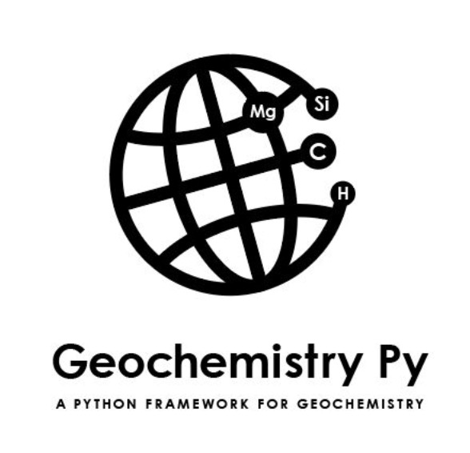
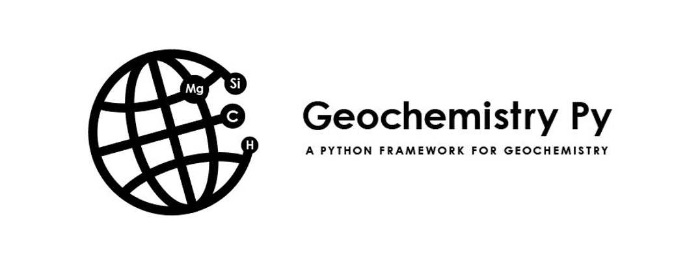

GeochemistryPy is **a Python framework** for data-driven geochemistry discovery.It provides an extendable tool and one-stop shop for **geochemical data analysis**.

The goal of the GeochemistryPy is to create user-friendly and extensible products of high automation for the full cycle of geochemistry research.

The whole package is under construction and the documentation is progressively evolving. 

