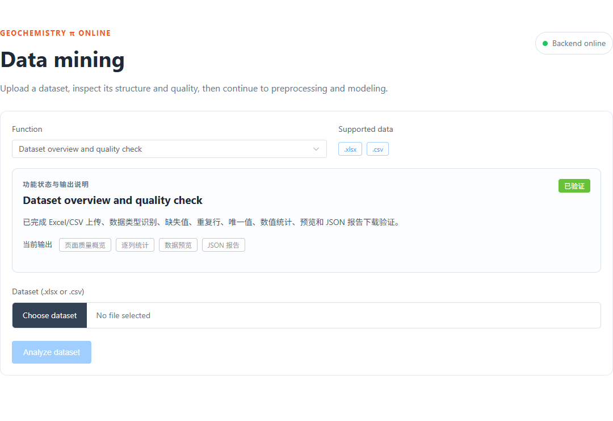
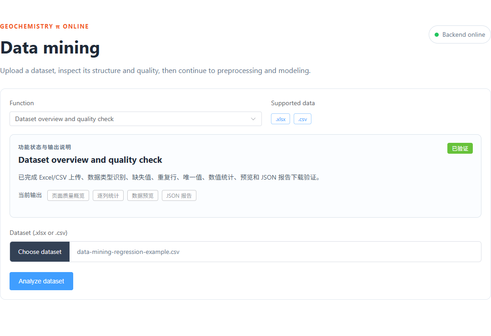
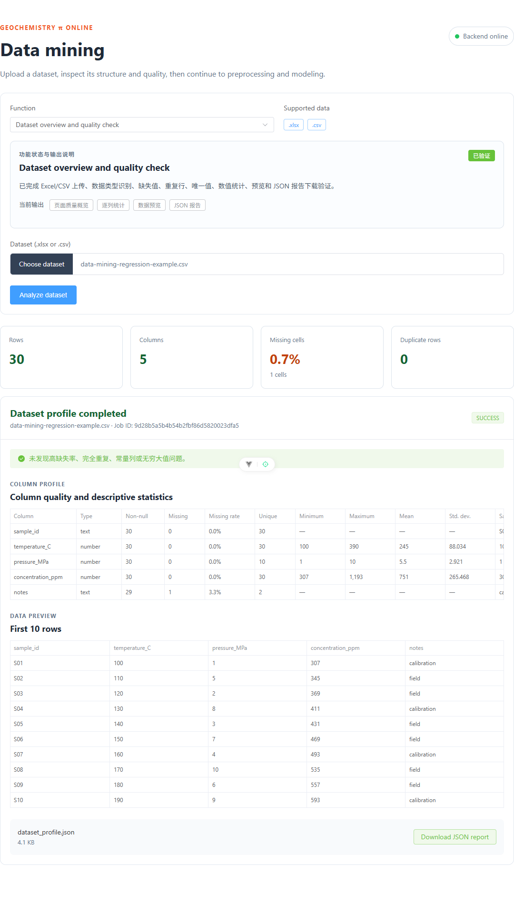
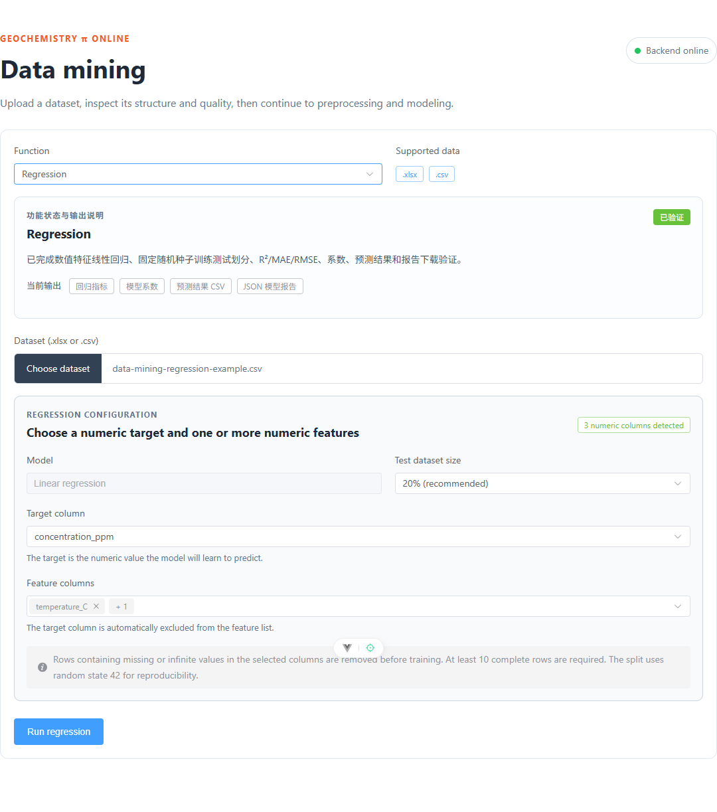
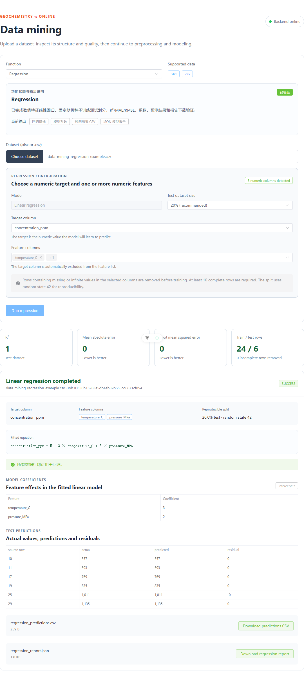
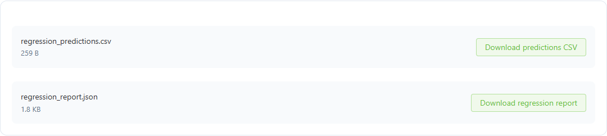

# Geochemistryπ Online Data Mining 网页使用示例

本教程只展示 **Data Mining** 模块，不涉及 Chemical Modeling。我们使用一个小型 CSV 数据集，先检查数据质量，再完成一次线性回归，最后下载预测结果和模型报告。

## 一、示例目标

示例任务是：

> 使用温度 `temperature_C` 和压力 `pressure_MPa` 预测浓度 `concentration_ppm`。

示例数据中故意使用了下面的线性关系：

```text
concentration_ppm = 5 + 3 × temperature_C + 2 × pressure_MPa
```

因此，如果网页回归功能正常，它应该能够恢复出接近 `5`、`3` 和 `2` 的截距与系数。

## 二、示例文件

上传文件：[`data-mining-regression-example.csv`](./data-mining-regression-example.csv)

| 列名 | 类型 | 用途 |
|---|---|---|
| `sample_id` | 文本 | 样品编号，不参与回归 |
| `temperature_C` | 数值 | 特征列1，表示温度 |
| `pressure_MPa` | 数值 | 特征列2，表示压力 |
| `concentration_ppm` | 数值 | 目标列，即希望预测的数值 |
| `notes` | 文本 | 备注，其中故意保留了一个空值 |

数据共有 30 行、5 列。`notes` 列的空值用于演示质量检查，它不在回归所选的特征列和目标列中，因此不会导致这次回归删除数据行。

## 三、操作步骤

### 步骤1：打开 Data Mining 页面

1. 在项目根目录双击 `start-online.cmd`。
2. 等待启动窗口显示 `Geochemistry Pi Online is ready.`。
3. 在浏览器打开 <http://127.0.0.1:5173/data-mining>。
4. 确认页面右上角显示绿色的 `Backend online`。

页面默认选中 `Dataset overview and quality check`，即“数据概览与质量检查”。右侧的 `.xlsx` 和 `.csv` 标签表示两种格式都支持。



### 步骤2：选择示例数据

1. 单击 `Choose dataset`。
2. 选择本目录中的 `data-mining-regression-example.csv`。
3. 确认按钮右侧显示了正确的文件名。

此时文件只是被选中，还没有开始执行质量检查。如果选错文件，可以再次单击 `Choose dataset` 重新选择。



### 步骤3：执行数据质量检查

1. 单击蓝色的 `Analyze dataset`。
2. 等待页面显示 `Dataset profile completed`。
3. 先看顶部的四个概览指标，再查看逐列统计和前 10 行预览。

本示例的预期结果是：

| 指标 | 预期值 | 含义 |
|---|---:|---|
| Rows | 30 | 共 30 条样品记录 |
| Columns | 5 | 共 5 个数据列 |
| Missing cells | 0.7% | 150 个单元格中有 1 个空值 |
| Duplicate rows | 0 | 没有完全重复的数据行 |

在逐列统计中，`notes` 列会显示 1 个缺失值和 3.3% 的列内缺失率；三个数值列应被正确识别为 `number`。



### 步骤4：切换到 Regression 并检查参数

1. 回到页面上方的 `Function` 下拉框。
2. 选择 `Regression`。
3. 页面会自动检测数值列，本示例应显示 `3 numeric columns detected`。
4. 保持 `Test dataset size` 为 `20% (recommended)`。
5. 确认 `Target column` 为 `concentration_ppm`。
6. 确认 `Feature columns` 中包含 `temperature_C` 和 `pressure_MPa`。

这两个特征在页面中可能显示为 `temperature_C` 和 `+1`，这是多选下拉框的折叠显示。将鼠标移到 `+1` 或展开下拉框，可确认第二个特征是 `pressure_MPa`。

网页会使用固定的随机种子 42 划分训练集和测试集，所以同一数据和参数的结果可以重复。



### 步骤5：运行回归并解读结果

1. 单击 `Run regression`。
2. 等待页面显示 `Linear regression completed`和 `SUCCESS`。
3. 查看模型评价指标、拟合方程、系数和测试集预测表。

本示例的预期结果是：

| 结果 | 预期值 | 如何理解 |
|---|---:|---|
| R² | 1 | 模型在测试集上完全解释了目标值变化 |
| Mean absolute error | 0 | 平均绝对误差约为 0 |
| Root mean squared error | 0 | 均方根误差约为 0 |
| Train / test rows | 24 / 6 | 80% 数据用于训练，20% 用于测试 |
| Intercept | 5 | 回归截距 |
| `temperature_C` coefficient | 3 | 温度增加 1，预测浓度增加约 3 |
| `pressure_MPa` coefficient | 2 | 压力增加 1，预测浓度增加约 2 |

页面恢复出的方程应为：

```text
concentration_ppm = 5 + 3 × temperature_C + 2 × pressure_MPa
```

本示例是专门构造的完美线性数据，所以 R² 等于 1 是预期现象。真实科研数据通常包含噪声、测量误差和未观测因素，不应该把 R² 必须等于 1 作为正常标准。



### 步骤6：下载预测数据和模型报告

页面底部会生成两个结果文件：

1. 单击 `Download predictions CSV` 下载 `regression_predictions.csv`。
2. 单击 `Download regression report` 下载 `regression_report.json`。



本次演示中已经下载的文件：

- [`regression_predictions.csv`](./downloads/regression_predictions.csv)：包含测试集中每行的实际值、预测值和残差。
- [`regression_report.json`](./downloads/regression_report.json)：包含数据划分、评价指标、拟合方程、截距、系数、预测预览和随机种子。

CSV 中出现类似 `1.1368683772161603e-13` 的极小残差是浮点数运算的舍入误差，可以视为 0，不是模型异常。

## 四、在自己的数据上使用时需要注意

- 文件必须是 `.xlsx` 或 UTF-8 编码的 `.csv`。
- 回归的目标列必须是数值列。
- 至少选择一个数值特征列。
- 目标列不能同时作为特征列，网页会自动将它从特征选项中排除。
- 所选列中包含缺失值或无穷值的数据行会在训练前被删除。
- 清理后至少需要 10 行完整数据。
- 特征数量过多、样本过少或特征彼此强相关时，系数可能不稳定。
- R² 不能单独证明模型有科学意义，还需要结合样本来源、变量定义、残差和独立验证进行判断。

## 五、常见问题

### `Backend offline`

说明后端没有运行。返回项目根目录，重新双击 `start-online.cmd`，然后刷新 Data Mining 页面。

### `Run regression` 按钮是灰色

通常是以下原因之一：

- 还没有选择数据文件；
- 数值列检测还没有完成；
- 没有选择目标列；
- 没有选择特征列；
- 后端服务不可用。

### 上传 CSV 后提示无法读取

请确认 CSV 使用 UTF-8 编码并以逗号分隔。如果数据来自 Excel，可以选择“CSV UTF-8（逗号分隔）”格式重新保存。

### 指标和预期差异很大

检查目标列和特征列是否选反，是否有单位混用、异常值、缺失值或数据泄漏。对真实数据，建议同时检查 R²、MAE、RMSE 和预测残差，不要只看单一指标。
