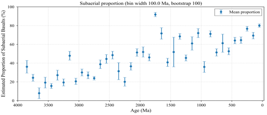
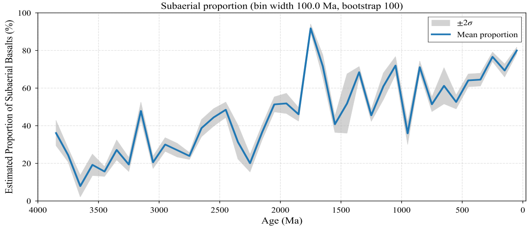

# Time Series

## 1. Introduction to Time Series Analysis

Time series analysis is a statistical technique for analyzing time-ordered data points to identify trends, patterns, and seasonal variations. In geochemistry, it is particularly valuable for understanding the evolution of Earth's systems over geological timescales, where data points are distributed across millions to billions of years.

The primary goals of time series analysis include trend identification (detecting long-term increases or decreases), pattern recognition (identifying periodic or cyclic signals), prediction (forecasting future values based on historical data), and anomaly detection (identifying unusual events or outliers). In geochemical applications, this approach can be used to study changes in mantle melting through Earth's history, secular evolution of continental crust composition, fluctuations in subaerial volcanic activity, and variations in trace element concentrations over geological time.

The Time Series module in Geochemistry π implements a sophisticated analysis framework specifically designed for geochemical data. It enables researchers to investigate temporal trends in large geochemical databases while accounting for data uncertainties and sampling biases, providing robust statistical inference through bootstrap resampling and uncertainty quantification. This module is particularly useful for reproducing and extending findings from landmark studies such as Keller and Schoene (2012) and Liu et al. (2024).

## 2. Introduction to Time Series Function of Geochemistry π

### 2.1 Enter the Time Series Sub-menu

To access the Time Series module, run the following command:

```python
geochemistrypi data-mining --desktop
```
After launching the software, you will see the following menu:

```python
-*-*- Built-in Training Data Option -*-*-
1 - Data For Regression
2 - Data For Classification
3 - Data For Clustering
4 - Data For Dimensional Reduction
5 - Data For Anomaly Detection
6 - Data For Time Series
(User) ➜ @Number: 6
Enter 6 and press Enter to proceed with the Time Series analysis.
```

### 2.2 Select the Data Identifier Column

After loading the Time Series dataset, the software will display the available columns and ask you to select an identifier column:

```python
Successfully loading the built-in training data set 'Data_Time_Series.xlsx'.
--------------------
Index - Column Name
1 - Compiled Source
2 - SOURCE
3 - REFERENCE
4 - SAMPLE_ID
5 - ROCK NAME
6 - LATITUDE
7 - LONGITUDE
8 - MIN_AGE
9 - AGE
10 - MAX_AGE
11 - R_MIN_AGE
12 - R_AGE
13 - R_MAX_AGE
14 - Estimated Proportion of Subaerial Basalts
15 - SIO2
16 - TIO2
17 - AL2O3
18 - FEOT
19 - FEOT.1
20 - MNO
21 - MGO
22 - CAO
23 - NA2O
24 - K2O
25 - P2O5
26 - SC
27 - V
28 - CR
29 - CO
30 - NI
31 - CU
32 - ZN
33 - GA
34 - RB
35 - SR
36 - Y
37 - ZR
38 - NB
39 - CS
40 - BA
41 - LA
42 - CE
43 - PR
44 - ND
45 - SM
46 - EU
47 - GD
48 - TB
49 - DY
50 - HO
51 - ER
52 - TM
53 - YB
54 - LU
55 - HF
56 - TA
57 - PB
58 - TH
59 - U
--------------------
(Press Enter key to move forward)

You need to choose the number of the column above as the output data identifier column.
The data identifier column helps identify uniquely each row of data point in the output data.
For example, when using built-in dataset, you can choose the column SAMPLE NAME.
Once finishing the whole run, in the output data files, each row of data will have the value in the column SAMPLE NAME as its unique identifier.
Enter the number of the output data identifier column.
(Data) ➜ @Number: 5
```

In this example, we select column 5 - ROCK NAME as the identifier. This column will be used to label each data point in the output files. Press Enter to continue.

### 2.3 Generate a Map Projection (Optional)

After selecting the identifier, you will be prompted to create a map projection:

```python
-*-*- World Map Projection -*-*-
World Map Projection for A Specific Element Option:
1 - Yes
2 - No
(Plot) ➜ @Number: 2
```

For Time Series analysis, we typically skip the map projection by selecting 2 - No. However, if you wish to visualize the spatial distribution of your data, you can choose 1 - Yes and follow the prompts to select an element for projection.

### 2.4 Select Data Range

Next, you will be asked to select the data range for analysis:

```python
Select the data range you want to process.
Input format:
Format 1: "[**, **]; **; [**, **]", such as "[1, 3]; 7; [10, 13]" --> you want to deal with the columns 1, 2, 3, 7, 10, 11, 12, 13 
Format 2: "**", such as "7" --> you want to deal with the columns 7 
@input: [6,14]
```

For Time Series analysis, you should select columns that include spatial coordinates (LATITUDE, LONGITUDE), age information (AGE, MIN_AGE, MAX_AGE), and the variable of interest (such as Estimated Proportion of Subaerial Basalts). In this example, we use [6,14] which selects columns 6 through 14:

```python
Index - Column Name
6 - LATITUDE
7 - LONGITUDE
8 - MIN_AGE
9 - AGE
10 - MAX_AGE
11 - R_MIN_AGE
12 - R_AGE
13 - R_MAX_AGE
14 - Estimated Proportion of Subaerial Basalts
--------------------
(Press Enter key to move forward)
```

The selected data will be displayed, showing the spatial coordinates, age information, and the variable of interest:

```python
The Selected Data Set:
       LATITUDE  LONGITUDE  MIN_AGE      AGE  MAX_AGE  R_MIN_AGE     R_AGE  R_MAX_AGE  Estimated Proportion of Subaerial Basalts
0       19.2500  -155.1300      0.0     0.01     0.01        0.0     0.005       0.01                                   0.176283
1       38.6300   -77.7900    144.0   175.00   206.00      144.0   175.000     206.00                                   0.584082
2       38.6300   -77.7900    144.0   175.00   206.00      144.0   175.000     206.00                                   0.494754
3       57.4500  -133.9200     65.0   156.50   248.00       65.0   156.500     248.00                                   0.146843
4       60.0600  -160.3900     65.0   156.50   248.00       65.0   156.500     248.00                                   0.926593
...         ...        ...      ...      ...      ...        ...       ...        ...                                        ...
22635   28.4948   -10.7088   1380.0  1380.00  1380.00     1373.0  1381.000    1389.00                                   0.994750
22636   28.4618   -10.5763   1380.0  1380.00  1380.00     1373.0  1381.000    1389.00                                   0.999140
22637   28.4438   -10.6903   1380.0  1380.00  1380.00     1373.0  1381.000    1389.00                                   0.992176
22638   10.5776   -10.5775   1380.0  1380.00  1380.00     1376.0  1383.000    1390.00                                   0.999835
22639   28.4635   -10.5756   1380.0  1380.00  1380.00     1373.0  1381.000    1389.00                                   0.999735

[22640 rows x 9 columns]
(Press Enter key to move forward)
```

### 2.5 Statistical Information and Correlation Analysis

The software will then display basic statistical information and generate correlation plots:

```python
-*-*- Basic Statistical Information -*-*-
<class 'pandas.core.frame.DataFrame'>
RangeIndex: 22640 entries, 0 to 22639
Data columns (total 9 columns):
 #   Column                                     Non-Null Count  Dtype  
---  ------                                     --------------  -----  
 0   LATITUDE                                   22640 non-null  float64
 1   LONGITUDE                                  22640 non-null  float64
 2   MIN_AGE                                    22623 non-null  float64
 3   AGE                                        22625 non-null  float64
 4   MAX_AGE                                    22623 non-null  float64
 5   R_MIN_AGE                                  22640 non-null  float64
 6   R_AGE                                      22640 non-null  float64
 7   R_MAX_AGE                                  22640 non-null  float64
 8   Estimated Proportion of Subaerial Basalts  22640 non-null  float64
dtypes: float64(9)
memory usage: 1.6 MB
None
Some basic statistic information of the designated data set:
           LATITUDE     LONGITUDE       MIN_AGE           AGE       MAX_AGE     R_MIN_AGE         R_AGE     R_MAX_AGE  Estimated Proportion of Subaerial Basalts
count  22640.000000  22640.000000  22623.000000  22625.000000  22623.000000  22640.000000  22640.000000  22640.000000                               22640.000000
mean      28.605905    -16.988858    693.307378    791.150956    888.743030    733.182697    752.688445    772.193492                                   0.655789
std       31.642881     95.685944   1087.010977   1231.319605   1394.163623   1154.175941   1163.292799   1173.138304                                   0.400838
min      -78.420000   -179.556000     -0.002000      0.000000      0.000000      0.000000      0.000000      0.000000                                   0.000050
25%       17.900000   -110.250000      1.800000      8.200000     10.400000      1.800000      8.400000     10.600000                                   0.198389
50%       37.830000    -25.000000     35.100000     48.650000     65.500000     35.400000     49.000000     65.500000                                   0.906550
75%       48.450000     57.900000   1117.000000   1200.000000   1210.000000   1202.000000   1221.500000   1272.000000                                   0.992440
max       81.921700    179.672000   3810.000000   3810.000000   3850.000000   3803.000000   3835.000000   3945.000000                                   0.999967
```

### 2.6 Handle Missing Values

The software will then check for missing values and provide options to handle them:

```python
-*-*- Missing Value Check -*-*-
Check which column has null values:
--------------------
LATITUDE                                     False
LONGITUDE                                    False
MIN_AGE                                       True
AGE                                           True
MAX_AGE                                       True
R_MIN_AGE                                    False
R_AGE                                        False
R_MAX_AGE                                    False
Estimated Proportion of Subaerial Basalts    False
dtype: bool
--------------------
The ratio of the null values in each column:
--------------------
MIN_AGE                                      0.000751
MAX_AGE                                      0.000751
AGE                                          0.000663
LATITUDE                                     0.000000
LONGITUDE                                    0.000000
R_MIN_AGE                                    0.000000
R_AGE                                        0.000000
R_MAX_AGE                                    0.000000
Estimated Proportion of Subaerial Basalts    0.000000
dtype: float64
--------------------
Note: you'd better use imputation techniques to deal with the missing values.
(Press Enter key to move forward)
```

```python
-*-*- Missing Values Process -*-*-
Caution: Only some algorithms can process the data with missing value, such as XGBoost for regression and classification!
Do you want to deal with the missing values?
1 - Yes
2 - No
(Data) ➜ @Number: 1
(Press Enter key to move forward)
```

```python
-*-*- Strategy for Missing Values -*-*-
1 - Drop Rows with Missing Values 
2 - Impute Missing Values
Notice: Drop the rows with missing values may lead to a significant loss of data if too many features are chosen.
Which strategy do you want to apply?
(Data) ➜ @Number: 1
(Press Enter key to move forward)
```

```python
-*-*- Drop the rows with Missing Values -*-*-
1 - Drop All Rows with Missing Values
2 - Drop Rows with Missing Values by Specific Columns
Notice: Drop the rows with missing values may lead to a significant loss of data if too many features are chosen.
Which strategy do you want to apply?
(Data) ➜ @Number: 1
```

In this example, we choose to drop rows with missing values. After this step, the software will display the cleaned dataset and save it:

```python
Successfully drop the rows with missing values.
The Selected Data Set After Dropping:
       LATITUDE  LONGITUDE  MIN_AGE      AGE  MAX_AGE  R_MIN_AGE     R_AGE  R_MAX_AGE  Estimated Proportion of Subaerial Basalts
0       19.2500  -155.1300      0.0     0.01     0.01        0.0     0.005       0.01                                   0.176283
1       38.6300   -77.7900    144.0   175.00   206.00      144.0   175.000     206.00                                   0.584082
2       38.6300   -77.7900    144.0   175.00   206.00      144.0   175.000     206.00                                   0.494754
3       57.4500  -133.9200     65.0   156.50   248.00       65.0   156.500     248.00                                   0.146843
4       60.0600  -160.3900     65.0   156.50   248.00       65.0   156.500     248.00                                   0.926593
...         ...        ...      ...      ...      ...        ...       ...        ...                                        ...
22618   28.4948   -10.7088   1380.0  1380.00  1380.00     1373.0  1381.000    1389.00                                   0.994750
22619   28.4618   -10.5763   1380.0  1380.00  1380.00     1373.0  1381.000    1389.00                                   0.999140
22620   28.4438   -10.6903   1380.0  1380.00  1380.00     1373.0  1381.000    1389.00                                   0.992176
22621   10.5776   -10.5775   1380.0  1380.00  1380.00     1376.0  1383.000    1390.00                                   0.999835
22622   28.4635   -10.5756   1380.0  1380.00  1380.00     1373.0  1381.000    1389.00                                   0.999735

[22623 rows x 9 columns]
Basic Statistical Information:
Successfully store 'Data Selected Dropped-Imputed' in 'Data Selected Dropped-Imputed.xlsx' in C:\Users\1\Desktop\geopi_output\time series\3\artifacts\data.
(Press Enter key to move forward)
```

### 2.7 Feature Engineering (Optional)

You can choose to create new features through arithmetic operations:

```python
-*-*- Feature Engineering -*-*-
The Selected Data Set:
--------------------
Index - Column Name
1 - LATITUDE
2 - LONGITUDE
3 - MIN_AGE
4 - AGE
5 - MAX_AGE
6 - R_MIN_AGE
7 - R_AGE
8 - R_MAX_AGE
9 - Estimated Proportion of Subaerial Basalts
--------------------
Feature Engineering Option:
1 - Yes
2 - No
(Data) ➜ @Number: 2
```

For Time Series analysis, feature engineering is optional. In this example, we skip it by selecting 2 - No.

### 2.8 Enter the Time Series Sub-Menu

After completing the data preparation steps, you will be prompted to select the analysis mode:

```python
-*-*- Mode Selection -*-*-
1 - Regression
2 - Classification
3 - Clustering
4 - Dimensional Reduction
5 - Anomaly Detection
6 - Time Series
(Model) ➜ @Number: 6
```

Select 6 - Time Series and press Enter to proceed.

## 3. Time Series Analysis

### 3.1 Configure Time Series Parameters

Once in the Time Series module, you will be prompted to configure the analysis parameters:

```python
-*-*- Time Series Analysis -*-*-
Select Age unit [Ma/Ga] (Ma): Ma
(Data) ➜ @Bin width (Ma): 100
(Data) ➜ @Bootstrap iterations: 100
Do we need to fit it? [Yes/No] (No): No
Using bin width = 100.0 Ma, bootstrap iterations = 100, fit = No
Start computing time series...
```

The parameters you need to specify are:

Parameter	Description	Recommended Value
Age unit	The time unit for the analysis	Ma (million years) or Ga (billion years)
Bin width	The time interval for binning the data	Typically 100 Ma for global studies
Bootstrap iterations	Number of resampling iterations for uncertainty estimation	100-1000 for initial tests; 10000 for publication-ready results
Fit option	Whether to apply fitting to the time series	Yes or No
In this example, we use:

Age unit: Ma

Bin width: 100 (Ma)

Bootstrap iterations: 100

Fit option: No

### 3.2 Process the Time Series

After configuring the parameters, the software will compute the time series analysis:

```python
Using bin width = 100.0 Ma, bootstrap iterations = 100, fit = No
Start computing time series...
Time series outputs saved under C:\Users\1\Desktop\geopi_output\time series\3\artifacts
Saved files: C:\Users\1\Desktop\geopi_output\time series\3\artifacts\Subaerial_proportion_100Ma_boot100.pdf and C:\Users\1\Desktop\geopi_output\time 
series\3\artifacts\Subaerial_proportion_100Ma_boot100.csv
(Press Enter key to move forward)
```

### 3.3 Output Files

The time series analysis generates a output file:
In fit part, if you choose No, your result will be:



If you choose Yes, your result will be:

